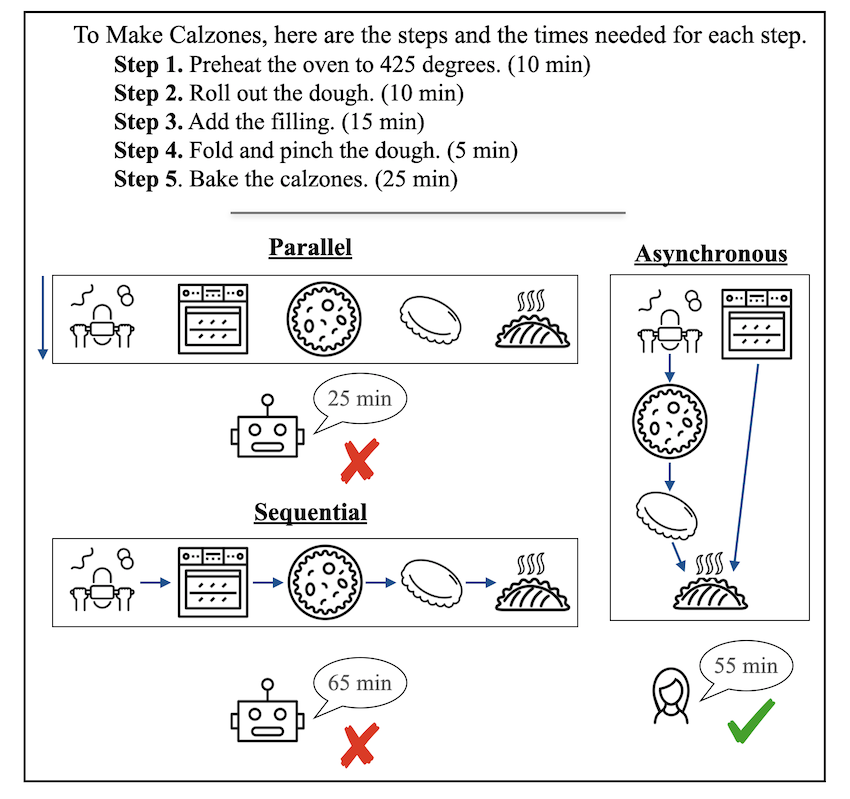

<!-- _pages/publications.md -->

<h4 class="year">2024</h4>
  <h2>[ICML 2024] <a href="https://arxiv.org/abs/2402.02805" target="_blank">Graph-enhanced Large Language Models in Asynchronous Plan Reasoning</a></h2>
  
My first project in DPhil! Very excited to have collaborated with fantastic researchers!

  

  
TL;DR: Off-the-shelf graph prompting consistently improves LLM performance in asynchronous planning.

  
1. We automatically generate and open-source a high-quality dataset for asynchronous planning which requires both sequential and parallel efficient sheduling. 

  
2. We find that LLMs are extremely poor when they are not supplied with detailed task illustrations for efficient asynchronous planning.

  
3. We propose an off-the-shelf prompting method Plan Like a Graph (PLaG) and we show that PLaG consistently boosts SOTA model performance over all complexity levels.

  
4. Despite the performance boost, we still find that LLMs tend to suffer from severe degradataion with increasing task complexities, which highlights the limitations of using LLMs to simulate digital devices.

<h4 class="year">2024</h4>
  <h2>[LREC-COLING 2024] <a href="https://arxiv.org/pdf/2404.03301" target="_blank">Probing Large Language Models for Scalar Adjective Lexical Semantics and Scalar Diversity Pragmatics</a></h2>
  
A short version of my master thesis!.

  

  
TL;DR: LLMs are quite good at scalar adjective lexical semantics but not at scalar diversity pragmatics.

  
Scalar adjectives pertain to various domain scales and vary in intensity within each scale (e.g. certain is more intense than likely on the likelihood scale). Scalar implicatures arise from the consideration of alternative statements which could have been made. They can be triggered by scalar adjectives and require listeners to reason pragmatically about them. Some scalar adjectives are more likely to trigger scalar implicatures than others. This phenomenon is referred to as scalar diversity. In this study, we probe different families of Large Language Models such as GPT-4 for their knowledge of the lexical semantics of scalar adjectives and one specific aspect of their pragmatics, namely scalar diversity. We find that they encode rich lexical-semantic information about scalar adjectives. However, the rich lexical-semantic knowledge does not entail a good understanding of scalar diversity. We also compare current models of different sizes and complexities and find that larger models are not always better. Finally, we explain our probing results by leveraging linguistic intuitions and model training objectives.

