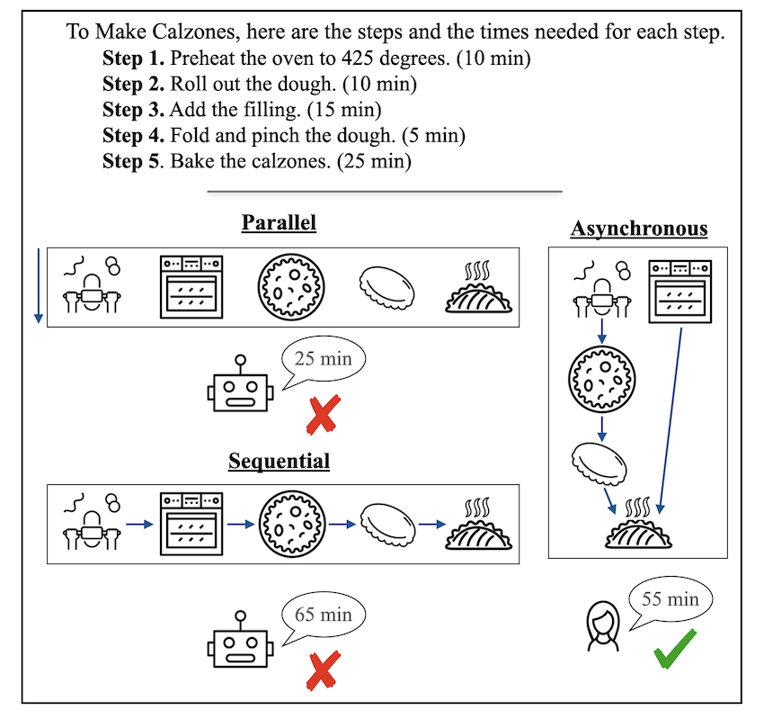

<!-- _pages/publications.md -->

<h4 class="year">2024</h4>
  <h2>Graph-enhanced Large Language Models in Asynchronous Plan Reasoning</h2>
  
Very exciting project in which we collaborated with fantastic researchers! Check out the paper here: <a href="https://arxiv.org/abs/2402.02805" target="_blank">Graph-enhanced Large Language Models in Asynchronous Plan Reasoning</a>.

  

  
TL;DR: Off-the-shelf graph prompting consistently improves LLM performance.

  
1. We automatically generate and open-source a high-quality dataset for asynchronous planning which requires both sequential and parallel efficient sheduling. 

  
2. We find that LLMs are extremely poor when they are not supplied with detailed task illustrations for efficient asynchronous planning.

  
3. We propose an off-the-shelf prompting method Plan Like a Graph (PLaG) and we show that PLaG consistently boosts SOTA model performance over all complexity levels.

  
4. Despite the performance boost, we still find that LLMs tend to suffer from severe degradataion with increasing task complexities, which highlights the limitations of using LLMs to simulate digital devices.

